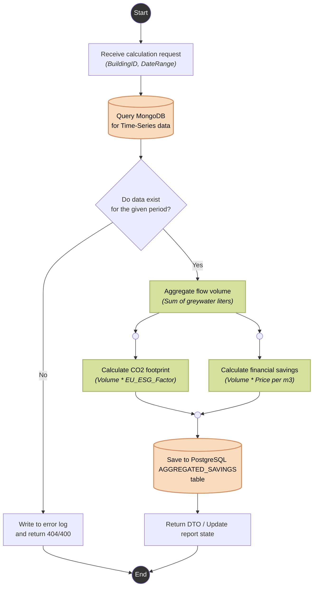

# ESG Savings Calculation Activity Diagram - HydroCycle OS MVP

This activity diagram visualizes the core business logic of the HydroCycle OS application: the process of aggregating telemetry data and calculating financial and ecological savings.

The calculation runs asynchronously on the Service layer (CalculatorContext), bridging the gap between the Time-Series database (MongoDB) and the relational database (PostgreSQL).

