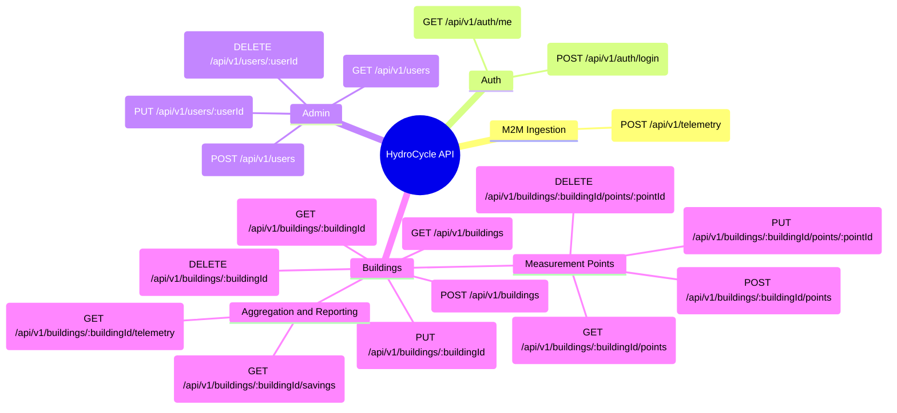

# API Specification - HydroCycle OS MVP

## 1. Architektonický přehled

### API Specification

This text represents the formal architectural contract, which is part of the project documentation docs/api-specification.md.

1. **M2M (Machine-to-Machine) Ingestion API**
   Serves exclusively for the separate Node.js script (IoT simulator). Protected by a static API key.
   * **POST /api/v1/telemetry**
     * **Purpose:** Processing HTTP POST payloads from sensors and storing them in MongoDB.
     * **Authentication:** Custom middleware (API Key).
     * **Payload:** `sensorMacAddress`, `timestamp`, `flowRate`, `volumeTotal`.

2. **Client API: Authentication and Authorization**
   REST API for the React dashboard. Protected via JWT tokens.  
   * **POST /api/v1/auth/login**
     * **Purpose:** Verification of credentials and returning a JWT token.
   * **GET /api/v1/auth/me**
     * **Purpose:** Retrieving details of the currently logged-in user.

3. **Client API: User Management (Admin role only)**
   Operations on the user entity in the relational database.  
   * **GET /api/v1/users** (List of all users in the system)
   * **POST /api/v1/users** (Creation of a new user/test manager)
   * **PUT /api/v1/users/:userId** (Update of user details or role)
   * **DELETE /api/v1/users/:userId** (Deletion of a user)

4. **Client API: Building Entity**
   Operations available for Admin and the assigned Facility Manager.
   * **GET /api/v1/buildings** (Retrieves buildings managed by the logged-in user)
   * **POST /api/v1/buildings** (Creation of a new building entity)
   * **GET /api/v1/buildings/:buildingId** (Details of a specific building)
   * **PUT /api/v1/buildings/:buildingId** (Update of name or address)
   * **DELETE /api/v1/buildings/:buildingId** (Deletion of the building and cascading deletion of relations)  

5. **Client API: Measurement Point Entity**
   Nested Resource logically linked to a building.
   * **GET /api/v1/buildings/:buildingId/points** (List of measurement point definitions)  
   * **POST /api/v1/buildings/:buildingId/points** (Assignment of a new sensor to the building)
   * **PUT /api/v1/buildings/:buildingId/points/:pointId** (Update of sensor location/name)
   * **DELETE /api/v1/buildings/:buildingId/points/:pointId** (Deletion of the sensor from the building)

6. **Client API: Aggregation and Reporting (Read-Only)**
   Endpoints providing data for automatic calculation and ESG report generation according to EU directives.  
   * **GET /api/v1/buildings/:buildingId/savings** 
     * **Purpose:** Returning data on saved potable water and CO2 from PostgreSQL.  
     * **Filters:** Option to pass query parameters for time boundaries (e.g., `?year=2026`).
   * **GET /api/v1/buildings/:buildingId/telemetry**
     * **Purpose:** Retrieving time-series data from the NoSQL database for visualization of daily cycles.  
     * **Filters:** Query parameters for the time window (`?startDate=...&endDate=...`).