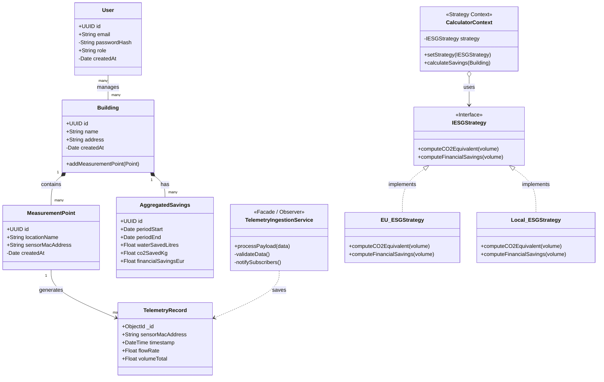

# Class Diagram - HydroCycle OS MVP

This diagram represents the static structure of the system, domain entities (separated by Polyglot Persistence), and key services with applied design patterns.

## Architectural Specification of Key Services

To maintain a clean separation of concerns (MVC) and ensure high performance for IoT data ingestion, the system utilizes specific design patterns.

### Class: `TelemetryIngestionService`

This service acts as the main entry point for incoming sensor data.

* **`+ processPayload(data)` (Facade Pattern):** Public method called directly from the Express.js controller. It serves as a "Facade" hiding the complexity of data validation and storage. The controller doesn't need to know which database is used under the hood.
* **`- validateData()` (Data Integrity Protection):** Private method that verifies the JSON payload format before database insertion. It ensures the filtering of duplicates and invalid values (e.g., negative flow rates), enforcing the *Garbage In, Garbage Out* principle.
* **`- notifySubscribers()` (Observer Pattern):** Private method handling asynchronous behavior. Upon successful telemetry storage in the fast MongoDB (Time-Series) database, it triggers an event caught by `CalculatorContext`. This initiates complex savings calculations in the background without blocking the sensor response (the system immediately returns `HTTP 201 Created`).

### Classes: `CalculatorContext` and `IESGStrategy`

* **Strategy Pattern:** The calculation of financial and CO2 savings can differ based on local regulations or European ESG directives (EU Taxonomy). Instead of complex `if-else` conditions, we use the `IESGStrategy` interface. During runtime, we can dynamically swap the calculation logic (e.g., using `EU_ESGStrategy`) based on the specific report the client has requested.