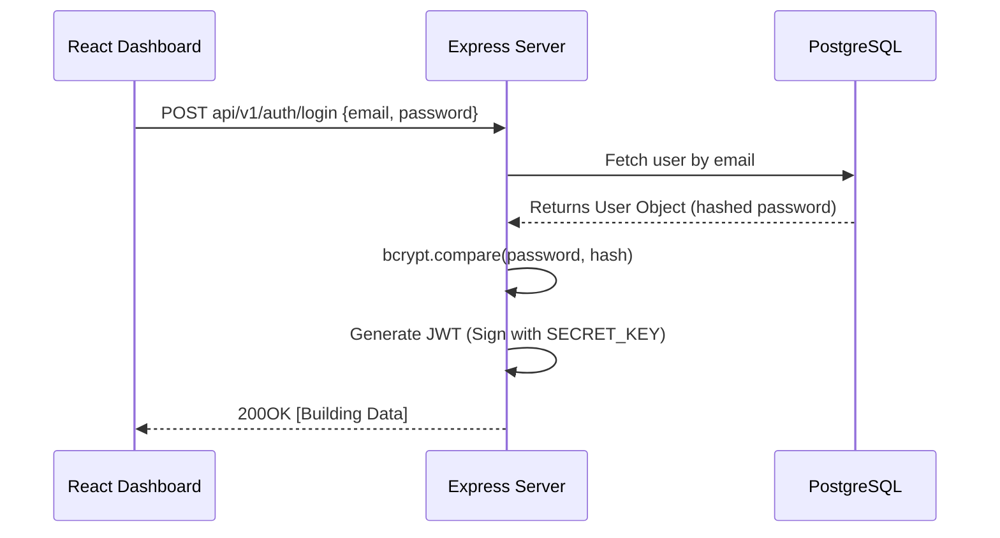

# Authentication model - HydroCycle OS MVP

The system uses a dual authentication strategy depending on the actor interacting with the API.

## Client Authentication (JWT - JSON Web Token)

Used by human actors (Admin, Facility Manager, Auditor) accessing the React Dashboard.

 * Mechanism: Stateless JWT Authentication
 * Flow:
    * 1. Client sends email and password to POST /api/v1/auth/login.
    * 2. Backend validates against PostgreSQL (using bcrypt for password hashing).
    * 3. Backend generates a sifned JWT and returns it to the client. 
    * 4. Client attaches the JWT to the Authorization: Bearer <token> header for all subsequent API calls.

* **JWT Payload Structure (Claims)**

To maintain security, the JWT payload contains only non-sensitive identification data. The ID of the user is stored in the standart sub (subject) claim.

{
    "sub": ""550e8400-e29b-41d4-a716-446655440000",
    "email": "manager@hydrocycle.com",
    "role": "FacilityManager",
    "iat": 1720368000,
    "exp": 1720371600
}

## Machine-to-machine (M2M) authentication

Used by the IIot to ingest telemetry data

 * Mechanism: Static API key.
 * Transport: Passed via the HTTP header Authorization: Bearer <M2M_API_KEY>.
 * Validation : Verified directly via custom Express.js middleware against enviromental variables.

# Role-Based Access Control (RBAC) Matrix

 Authorization is handled via middleware that checks the role claim in the verified JWT against allowed roles for a specific endpoint.

## Defined Roles:

 * Admin (System administrator): Full access to global management and global oversight.
 * Facility Manager (Standart User): Manages the buildings and sensor assigned to their account.
 * ESG Auditor (Read-Only): External auditor requiring access to generated reports and historical telemetry for compliance verification

## Access Matrix:

| Resource / Endpoint | Admin | Facility Manager | ESG Auditor | IoT Sensor |
| :--- | :---: | :---: | :---: | :---: |
| **Auth** (`/auth/login`, `/auth/me`) | Read | Read | Read | *Deny* |
| **Users** (`/users`) | CRUD | Read (Self only) | *Deny* | *Deny* |
| **Buildings** (`/buildings`) | CRUD | CRUD (Assigned only) | Read (Assigned only) | *Deny* |
| **Measurement Points** (`/buildings/:buildingId/points`) | CRUD | CRUD (Assigned only) | Read (Assigned only) | *Deny* |
| **Telemetry Ingestion** (`POST /telemetry`) | *Deny* | *Deny* | *Deny* | Write |
| **Telemetry History** (`GET /telemetry`) | Read | Read (Assigned only) | Read (Assigned only) | *Deny* |
| **ESG Savings Data** (`GET /savings`) | Read | Read (Assigned only) | Read (Assigned only) | *Deny* |