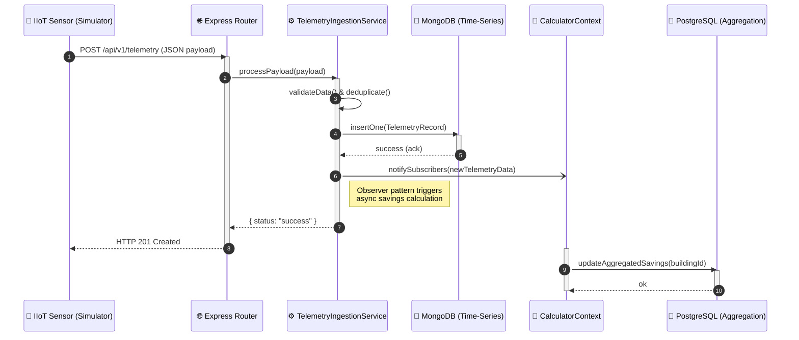

# Sequence Diagram - HydroCycle OS MPp

This diagram visualizes the critical path of the MVP: the telemetry data ingestion process. It demonstrates the MVC data flow, the Facade pattern for service abstraction, and the asynchrounous Observer pattern used for Polygot Persistence updates.

