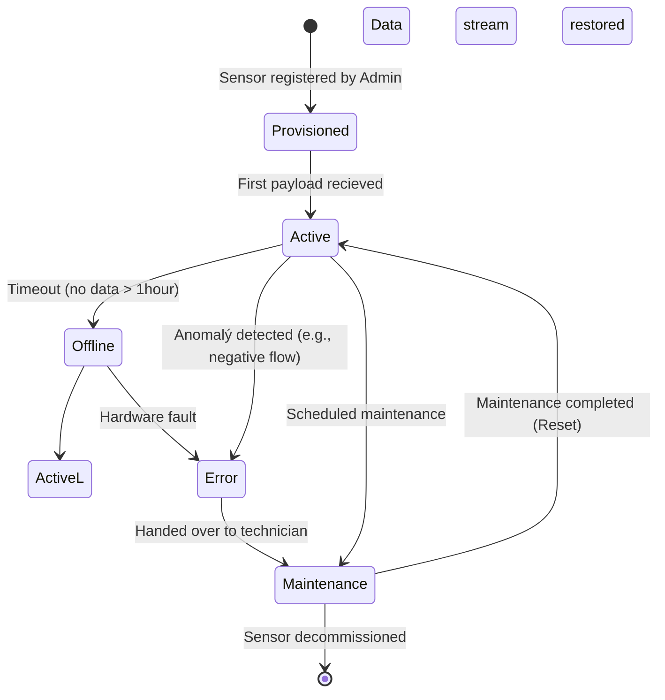
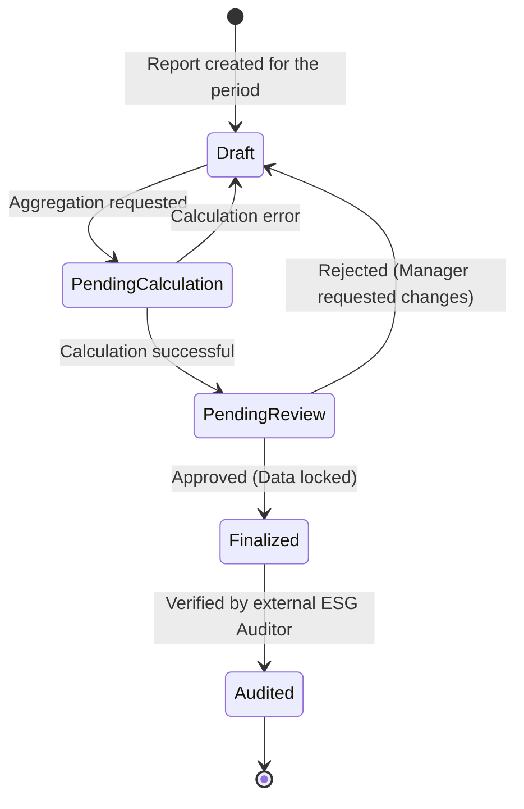

# State Machines - HydroCycle OS MVP

This document defines the Finite State Machines (FSM) for key system entities. Strict adherence to these state transitions on the Service layer is essential for maintaining data integrity, immutability, and auditability in a B2B enterprise environment.

## 1. IoT Sensor Lifecycle (Measurement Point)

Defines the operational state of a physical flow meter from the backend's perspective. It prevents the system from processing telemetry data from sensors that are flagged for maintenance or hardware faults.

State descriptions:
* Provisioned: The sensor has been created in the database, but the Ingestion API has not yet received any telemetry data.
* Active: Standard operation; the sensor is regularly transmitting telemetry payloads.
* Offline: Communication failure detected. This transition can be triggered by a background cron job monitoring the last payload timestamp.
* Error: The system detected corrupted or illogical data (e.g., negative flow rates). Data ingestion for this sensor is temporarily halted.
* Maintenance: A manual state forced by the Facility Manager during physical repair or recalibration.

## 2. ESG Report Lifecycle

Ensures data immutability once a report enters the approval pipeline. This is critical for legislative compliance and financial auditing.

State descriptions:
* Draft: The default initial state. Parameters (e.g., time window, included buildings) can be freely modified.
* PendingCalculation: A transient state where the backend asynchronously calculates the conversion of saved water volume into financial savings and CO2 equivalents.
* PendingReview: The calculation is complete, and the aggregated data is ready for managerial review.
* Finalized: The report is locked (Read-Only) and cannot be regenerated, protecting against retrospective data manipulation.
* Audited: The terminal state, confirming the report has been successfully verified by a third-party ESG Auditor.